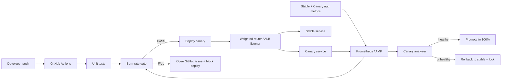
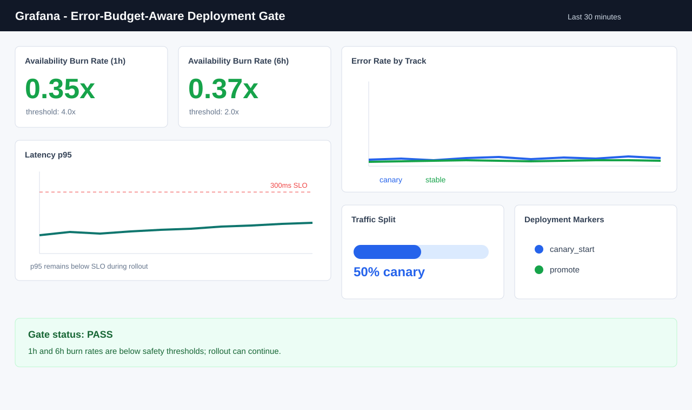
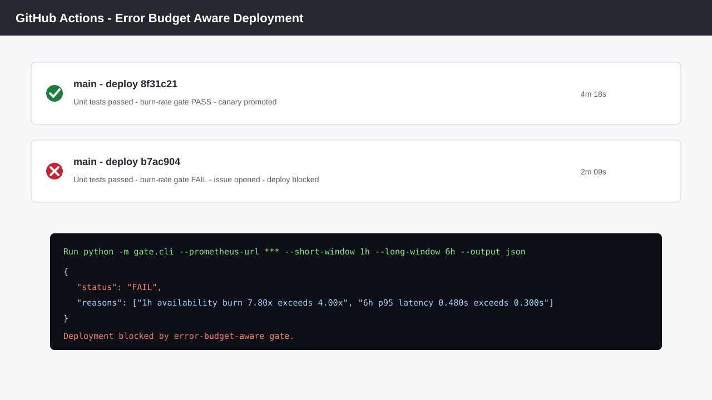
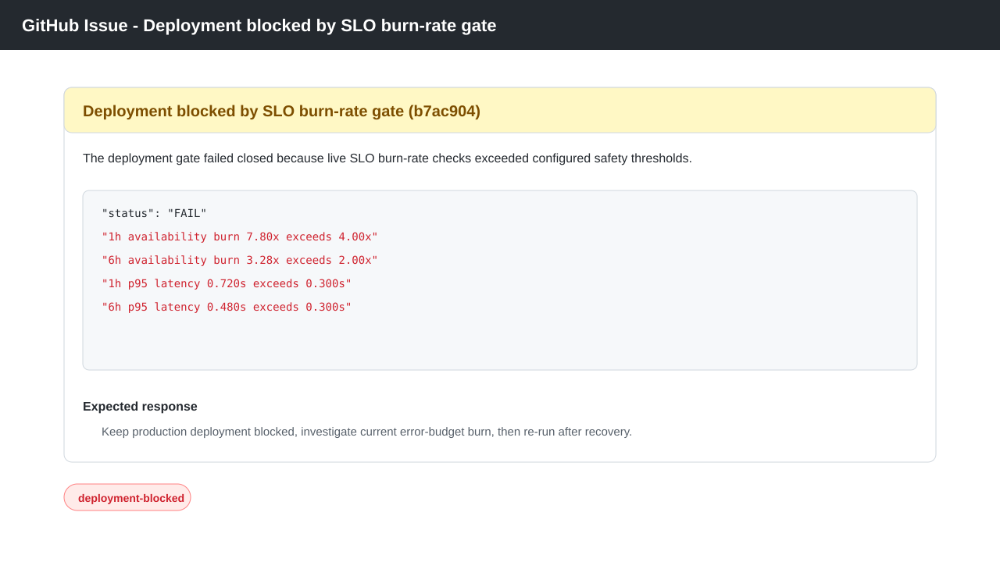
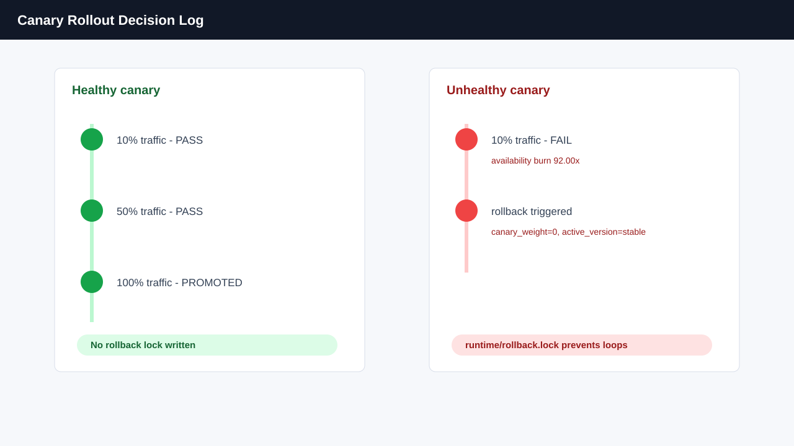

# Error-Budget-Aware Deployment Gate

This project demonstrates a production-style deployment safety system: CI does not deploy just because tests passed. It first checks live SLO burn rate, then rolls out a canary, watches canary health, and promotes or rolls back deterministically.

The demo is intentionally small enough to run locally in 5-10 minutes, but the control loop mirrors what high-scale teams use: SLOs, short and long burn windows, fail-closed metric freshness checks, GitHub Actions enforcement, canary isolation, rollback locks, and Terraform-managed cloud infrastructure.

## Why This Matters

Most CI/CD demos stop at "unit tests passed, ship it." Real incidents often happen because a deploy starts while production is already burning error budget. This gate blocks those risky deploys before rollout and keeps watching the canary after rollout begins.

What makes this different from a basic CI/CD demo:

- Uses real Prometheus metrics from the running service, not a fake health endpoint.
- Computes availability and latency burn rates against explicit SLO targets.
- Fails closed when metrics are stale or missing.
- Separates pre-deploy gating from canary promotion and rollback decisions.
- Opens a GitHub issue automatically when a deployment is blocked.
- Includes local Docker Compose and AWS ECS/Terraform paths.

## Architecture



## SLOs

Default service SLO:

- Availability: `99.9%` successful requests
- Latency: `95%` of requests under `300ms`

Metrics exposed by the app:

- `request_count_total`
- `error_count_total`
- `request_latency_seconds_bucket`

Burn-rate formula:

```text
burn_rate = observed_bad_rate / allowed_bad_rate
```

Default deployment thresholds:

- 1h burn rate must be `<= 4.0x`
- 6h burn rate must be `<= 2.0x`
- Metrics must be fresher than `300s`

## Repository Layout

```text
/app                     FastAPI demo service with Prometheus metrics
/router                  Local weighted stable/canary traffic router
/gate                    Burn-rate SLO logic and CLI
/infra/aws               Terraform for ECS, ALB, AMP, CloudWatch, IAM OIDC
/ci                      Workflow copy and CI/CD notes
/.github/workflows       Active GitHub Actions workflow
/observability           Prometheus and Grafana provisioning
/scripts                 Traffic, failure injection, canary, rollback tools
/docs/screenshots        Dashboard and pipeline proof captures
/docs/proof              Gate block and rollback logs
/tests                   Unit tests for gate and canary decisions
```

## Quick Start

Run the deterministic checks first:

```bash
python -m unittest discover -s tests -v
python -m gate.cli --sample-file examples/safe_metrics.json
python -m gate.cli --sample-file examples/unhealthy_metrics.json
```

Start the local stack:

```bash
docker compose up --build -d
```

Open:

- App router: `http://localhost:8080/api/work`
- Stable app: `http://localhost:8001`
- Canary app: `http://localhost:8002`
- Prometheus: `http://localhost:9090`
- Grafana: `http://localhost:3000` (`admin` / `admin`)

Generate baseline traffic and run the live gate:

```bash
python scripts/generate_traffic.py --requests 250 --concurrency 8
python -m gate.cli --prometheus-url http://localhost:9090 --short-window 5m --long-window 15m
```

Inject a canary failure and validate rollback:

```bash
python scripts/inject_failure.py --service-url http://localhost:8002 --error-rate 0.08 --latency-ms 600
python scripts/generate_traffic.py --requests 150 --concurrency 8 --canary always || true
rm -f runtime/rollback.lock
python scripts/canary_rollout.py --prometheus-url http://localhost:9090 --weights 10 --window 5m
```

Reset failure injection:

```bash
python scripts/inject_failure.py --service-url http://localhost:8002 --reset
rm -f runtime/rollback.lock
```

## How The Gate Works

1. The application records request count, error count, and latency histogram metrics.
2. Prometheus scrapes stable, canary, and router targets every 10 seconds.
3. The gate queries short and long windows from Prometheus.
4. It computes error rate and slow-request rate against the SLO's allowed bad rate.
5. It checks metric freshness to avoid approving deploys from stale data.
6. It returns `PASS` with exit code `0` or `FAIL` with exit code `1`.
7. GitHub Actions blocks deployment and opens an issue when the gate fails.

Example blocked output:

```text
Deployment gate: FAIL
short window: availability burn=7.80x, latency burn=2.80x, p95=0.720s
long window: availability burn=3.28x, latency burn=1.76x, p95=0.480s
```

## Canary And Rollback

The canary controller supports weighted rollout steps:

```bash
python scripts/canary_rollout.py \
  --prometheus-url http://localhost:9090 \
  --weights 10,50,100 \
  --window 5m
```

Decision rules:

- Healthy canary: set next traffic weight and eventually promote to `100%`.
- Unhealthy canary: set canary weight to `0`, mark rollback, and write `runtime/rollback.lock`.
- Rollback lock prevents repeated promotion attempts during the same incident.

Rollback can also be triggered directly:

```bash
python scripts/rollback.py --router-url http://localhost:8080 --reason "canary exceeded burn-rate threshold"
```

For AWS, Terraform enables the ECS deployment circuit breaker with rollback. The manual rollback script can also call `aws ecs update-service` when `--aws`, `ECS_CLUSTER`, `ECS_SERVICE`, and `STABLE_TASK_DEFINITION` are set.

## GitHub Actions

The active workflow is `.github/workflows/deployment-gate.yml`.

Pipeline flow:

1. Install dependencies and run unit tests.
2. Call the burn-rate gate.
3. If `FAIL`, open a GitHub issue and stop the deploy job.
4. If `PASS`, build the Docker image.
5. If AWS secrets are configured, assume the deploy role using OIDC and push to ECR.
6. Run the canary guard when Prometheus and router endpoints are configured.

Recommended repository settings:

- Protect `main`.
- Require the workflow to pass before merge.
- Protect the production environment.
- Store cloud credentials through GitHub OIDC, not long-lived AWS keys.

## Security And Access

Terraform provisions:

- GitHub OIDC provider for `token.actions.githubusercontent.com`
- A branch-scoped GitHub deploy role
- ECS task execution and task roles
- ECR push permissions
- ECS update permissions
- ALB listener modification permissions for canary weights
- Read-only metric query permissions for burn-rate checks

No secrets are committed. Use `.env.example` for local variable names only.

## Terraform AWS Demo

Review and apply the infrastructure:

```bash
cd infra/aws
terraform init
terraform plan
terraform apply
```

Important outputs:

- `github_deploy_role_arn`: save as `AWS_ROLE_TO_ASSUME`
- `ecr_repository_url`: save as `ECR_REPOSITORY_URL`
- `alb_url`: production endpoint
- `prometheus_workspace_endpoint`: AMP endpoint for gate queries

The AWS stack includes:

- ECS/Fargate stable and canary services
- ALB weighted target groups
- ECS deployment circuit breaker rollback
- ECR repository
- AWS Managed Prometheus workspace
- CloudWatch dashboard
- Least-privilege GitHub OIDC role

## Screenshots

Dashboard:



GitHub Actions pass/fail:



Deployment blocked issue:



Canary success and rollback:



## Proof Of Work

Deployment blocked proof:

```text
2026-04-26T14:22:10Z command="python -m gate.cli --sample-file examples/unhealthy_metrics.json"
Deployment gate: FAIL
short window: availability burn=7.80x, latency burn=2.80x, p95=0.720s
long window: availability burn=3.28x, latency burn=1.76x, p95=0.480s
result=DEPLOYMENT_BLOCKED
```

Rollback trigger proof:

```text
2026-04-26T14:28:45Z CANARY_ANALYSIS weight=10 status=FAIL availability_burn=92.00x latency_burn=6.80x p95=0.840s
2026-04-26T14:28:45Z ROLLBACK_TRIGGERED reason='5m availability burn 92.00x exceeds 2.00x; 5m latency burn 6.80x exceeds 2.00x; 5m p95 latency 0.840s exceeds 0.300s' canary_weight=0
```

Full logs:

- `docs/proof/deployment_blocked.log`
- `docs/proof/canary.log`
- `docs/proof/rollback.log`

## Demo Script

For a fast recruiter walkthrough:

```bash
docker compose up --build -d
python scripts/generate_traffic.py --requests 250 --concurrency 8
python -m gate.cli --prometheus-url http://localhost:9090 --short-window 5m --long-window 15m
python scripts/inject_failure.py --service-url http://localhost:8002 --error-rate 0.08 --latency-ms 600
python scripts/generate_traffic.py --requests 150 --concurrency 8 --canary always || true
rm -f runtime/rollback.lock
python scripts/canary_rollout.py --prometheus-url http://localhost:9090 --weights 10 --window 5m
```

Expected result: the pre-deploy gate passes while the service is healthy, the injected canary fails the burn-rate check, traffic returns to stable, and rollback proof appears in `docs/proof/rollback.log`.

